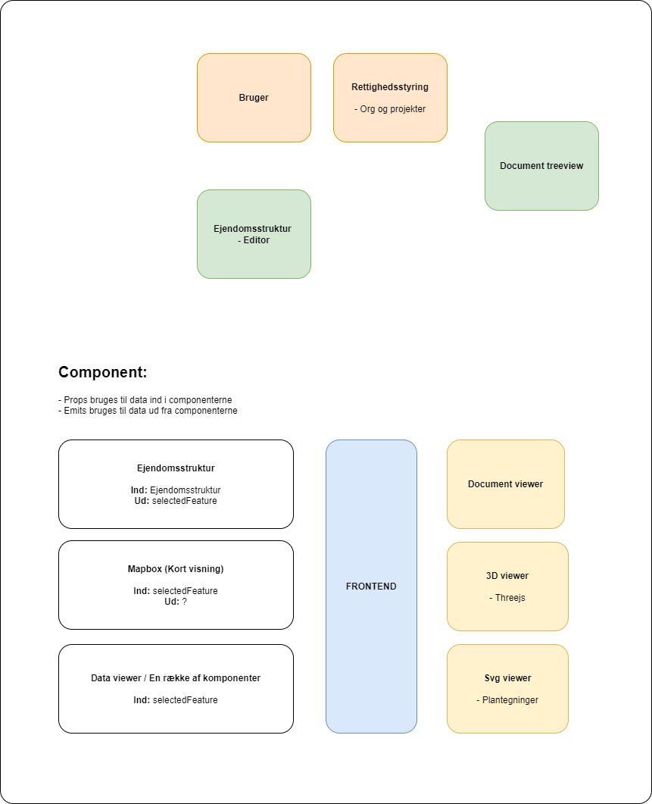

# Komponenter

I webudvikling refererer "components" til genanvendelige og isolerede blokke af kode, som kan bruges til at bygge webapplikationer på en mere modulær måde.

En component består typisk af HTML-kode, CSS-styling og JavaScript-kode, der definerer dens funktion og udseende. Components kan indeholde logik, der styrer deres opførsel, og kan kommunikere med andre components og tilstandsstyring, hvis det anvendes.

Components i webudvikling gør det muligt at opdele en større applikation i mindre, mere overskuelige dele, som kan udvikles og testes separat. Components kan også genbruges i forskellige dele af en applikation og i forskellige applikationer, hvilket kan føre til mere effektiv udvikling og vedligeholdelse af webapplikationer.

Mange JavaScript-rammeworks og biblioteker leveres med en række foruddefinerede components, og udviklere kan også oprette deres egne custom components til at opbygge deres applikationer.

